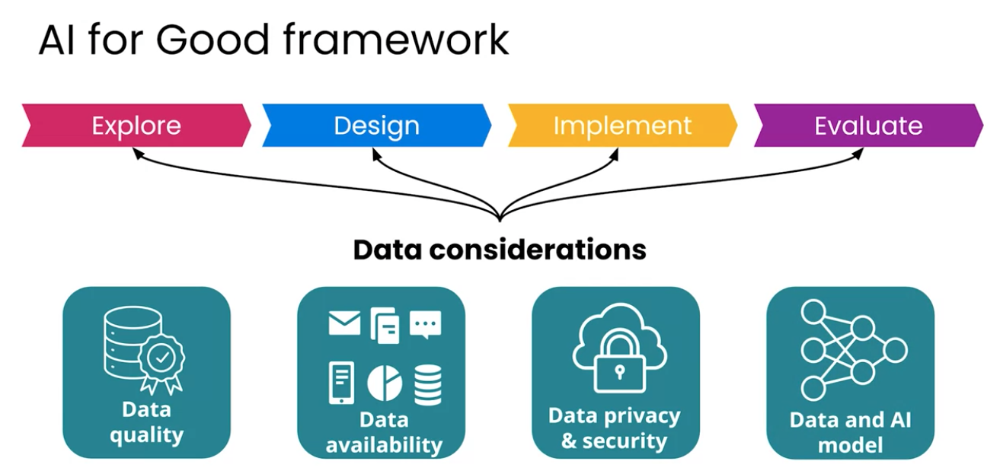

# AI-for-Good

AI for Good Specialisation by DeepLearning.ai

## Notes

### AI and Public Health

#### Week 1

"AI for Good" is a term used for AI that provide support and prevents, mitigates, or resolves problems affecting human life or the environment. In this specialization we focus on how it does this in the environment, health, justice, and humanitarian action sectors.

AI applications make decisions based on historical data. If the data is biased, the AI will be biased.

As an example of how to think about AI for Good, here are the UN Sustainable Development Goals:

1. No Poverty
2. Zero Hunger
3. Good Health and Well-being
4. Quality Education
5. Gender Equality
6. Clean Water and Sanitation
7. Affordable and Clean Energy
8. Decent Work and Economic Growth
9. Industry, Innovation and Infrastructure
10. Reduced Inequality
11. Sustainable Cities and Communities
12. Responsible Consumption and Production
13. Climate Action
14. Life Below Water
15. Life on Land
16. Peache, Justice and Strong Institutions
17. Partnerships for the Goals

"Do no harm" is a good principle meaning everyone impacted by a project is left improved or unchanged.

Deep Learning is a subset of Machine Learning, which is a subset of AI.

Areas of concern to consider when applying AI to a problem:

- Is AI the right solution? This needs to be figured out early so that time and resources are not wasted.
- Pernsonally identifiable inromation (PPI) should be treated with care and most likely not stored. This data should not be published or archived since it could be used to oppress certain groups of people.
  - An example is not publishing the location of endangered species, since poachers could use this information to find and kill them.
- Consider the advice from all stakeholders that would be impacted by the project.
